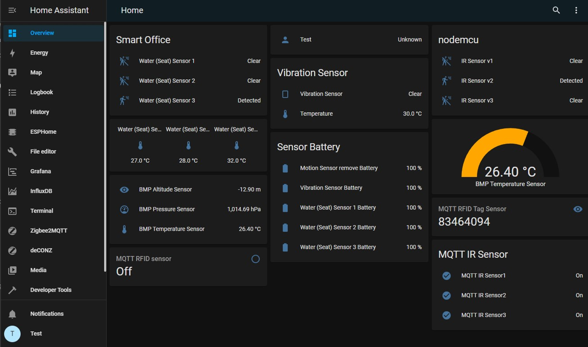
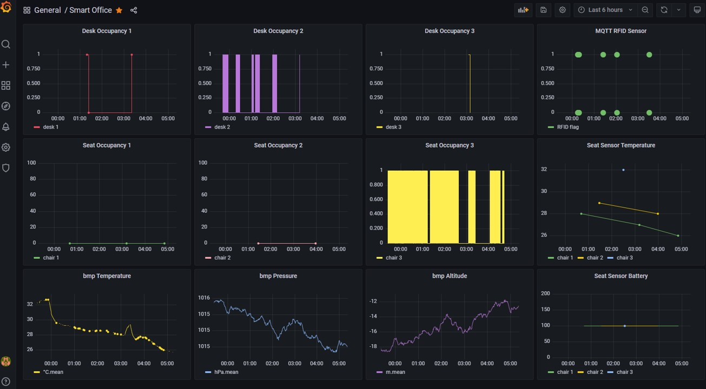
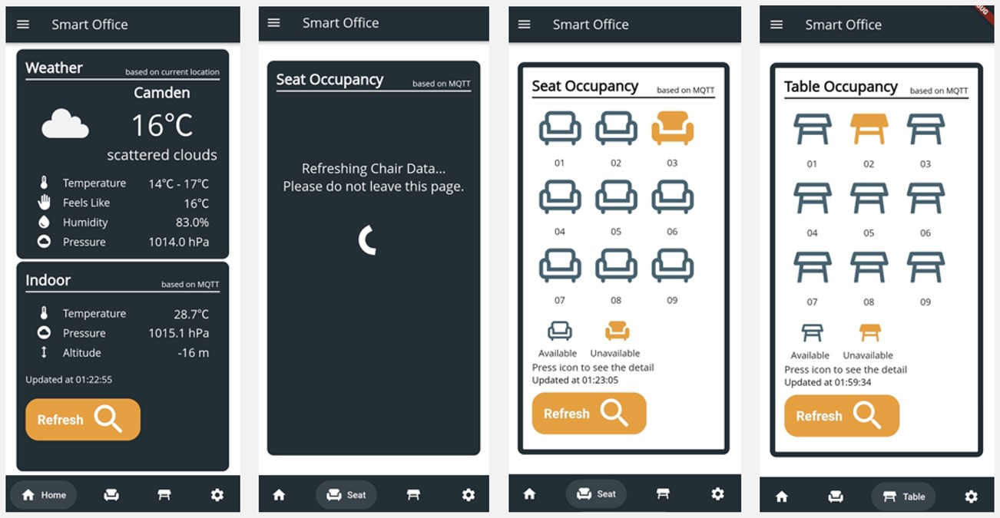
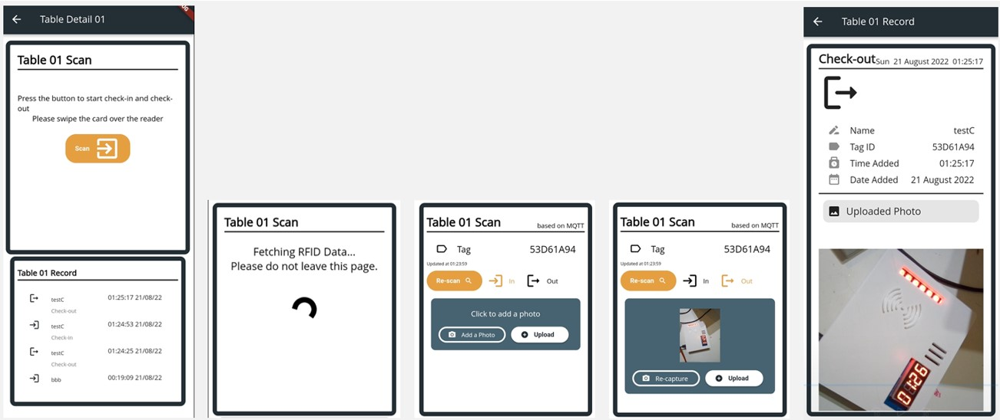

# smart_office_project

This is the repo for MSc CE dissertation.

### Introduce

The project introduces a method to build a seat occupancy system with a smart IoT office system. It contains three subsystems, which are smart chair system, smart desk occupancy system and smart desktop clock system, to provide desk occupancy monitoring, chair occupancy monitoring, desk check-in and out, and office indoor environmental parameter measurement. A Flutter App is designed for user interaction and data visualisation. 3D print PLA enclosure are used for sensor boxes. The system can be deployed in the office or study space.

------

### Hardware Requirements

+ Seat pressure sensors and Zigbee binary sensors.
+ Infrared motion sensor with ESP8266 NodeMCU module.
+ Integrated desktop clock with Arduino Nano 33 IoT.

##### Components List

+ Hub and Gateway

  + Raspberry Pi
  + ConBee II ZigBee Gateway

+ Chair sensor

  + Aqara water leak sensor

  + Seat pressure sensor

  + CR2032 Lithium Battery

+ Smart Desktop Clock

  + Arduino Nano 33 IoT
  + NeoPixel Stick
  + RC522 RFID module
  + BMP180 Sensor
  + TM1637 4-digits Display

+ Smart Desk Occupancy System

  + Lithium polymer ion battery
  + ESP8266 NodeMCU
  + HC-SR312 PIR motion sensor

+ Circuit board components

  + Stripboards
  + Solid wires
  + Connectors

+ Enclosures

  + 3D printed boxes and connectors
  + Cushion 

----------

### Software requirements

#### Home Assistant Installation

**Prerequisites:** 

1. Raspberry Pi 4
2. Power supply
3. SD card reader
4. Micro SD card

**Boot media:**

1. Attach SD card to computer as the boot media.
2. Download flasher software. ([Balena Etcher](https://www.balena.io/etcher/))
3. Flash from URL ```https://github.com/home-assistant/operating-system/releases/download/8.4/haos_rpi4-64-8.4.img.xz``` for Raspberry Pi 4 64-bit.
4. Download image, select SD card and flash.

**Setup Wi-Fi:**

1. Place the flashed SD card to a Windows PC.

2. Open it with file explorer.

3. Create a new folder named "CONFIG".

4. Open the folder and create another folder named "network"

5. Open the "network" folder create a plain text file named "my-network".

6. Edit it as follows. The [online UUID generator](https://www.uuidgenerator.net/version1)

   ```properties
   [connection]
   id=my-network
   uuid=72111c67-4a5d-4d5c-925e-f8ee26efb3c3
   type=802-11-wireless
   
   [802-11-wireless]
   mode=infrastructure
   ssid=MY_SSID
   # Uncomment below if your SSID is not broadcasted
   #hidden=true
   
   [802-11-wireless-security]
   auth-alg=open
   key-mgmt=wpa-psk
   psk=MY_WLAN_SECRET_KEY
   
   [ipv4]
   method=auto
   
   [ipv6]
   addr-gen-mode=stable-privacy
   method=auto
   ```

7. Save the changes, remove the SD card and plug into Raspberry Pi.
8. Boot Raspberry Pi, the specified network should be connected.

**Config Home Assistant**

1. After network connection, Home Assistant can be accessed in the browser of the Desktop system on `homeassistant.local:8123`, or `homeassistant:8123`, or `http://[IPAddress]:8123`in a few minutes.
2. Follow the instructions in [Home Assistant official guideline](https://www.home-assistant.io/getting-started/onboarding/).

#### Flutter Mobile App

**Prerequisites:** 

1. Any Operating System (Linux, Windows, MacOS etc.)
2. Any IDE with Flutter SDK installed (VSCode, Android Studio, XCode, etc.)
3. Basic knowledge and practice of Flutter and Dart.
4. Setup Firebase App based on [Firebase official guideline](https://firebase.google.com/docs/guides).

**Dependencies:**

```yaml
  cupertino_icons: ^1.0.2
  cloud_firestore: ^3.1.14
  firebase_auth: ^3.3.17
  firebase_core: ^1.12.0
  firebase_storage: ^10.2.16
  provider: ^6.0.2
  google_fonts: ^2.3.2
  bottom_bar: ^1.3.0+1
  geolocator: ^8.2.0
  weather: ^2.0.1
  mqtt_client: ^9.6.2
  camera: ^0.9.4+21
```

----

### Data Visualisation

#### Grafana with InfluxDB in Home Assistant

Home Assistant 



Grafana



App





----

### Application Demo YouTube Link

https://youtube.com/shorts/BBJ_iGN9C2Y?feature=share


-----

## Contact Details

If you have any questions, please feel free to contact me: [minghao.zhang.21@ucl.ac.uk](https://github.com/virgolibra/casa0015-mobile-assessment/blob/master/minghao.zhang.21@ucl.ac.uk)